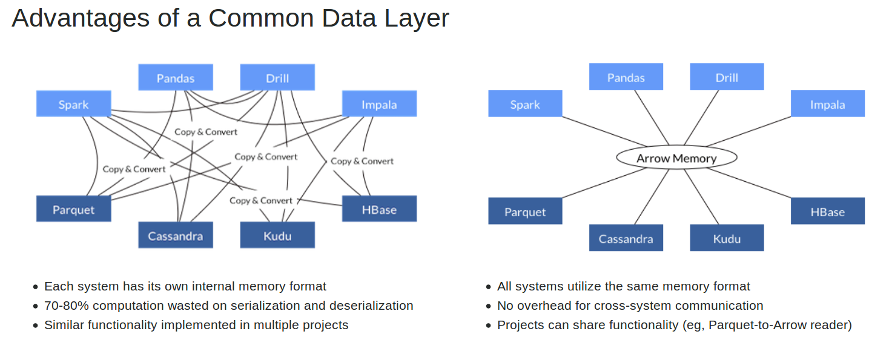

# Pickles

Experiments in pickling (data serialization) in Golang and Python.

## Motivation

Parsing input data for machine learning is a time-intensive process.

It's a recommended practice to serialize parsed data (pickle it) so as
to reduce the overhead of continually processing input data - especially
for static datasets.

For a number of reasons, machine learning is normally carried out
in Python. But as I was trying out
[Golang for machine learning](http://github.com/mramshaw/gophernet) 
it seemed like a good idea to look into pickling and whether or not
it could be done in a language-agnostic way.

## Python options

Basically, for Python there's `pickle`:

    http://docs.python.org/3/library/pickle.html

There are other options but the use of `pickle` is pretty widespread.

If the intention is a solution that is language-agnostic, it
is probably a good idea (for compatibility reasons) to avoid
specifying `protocol=pickle.HIGHEST_PROTOCOL` as this may result
in the use of an unsupported format. That said, it is probably
a good idea to use the highest language-agnostic format (2 or 3)
as they seem to support more datatypes than earlier versions.

Note that the __default__ protocol is __3__ (which is a Python 3
format).

If performance is a concern (when is it not?) then there is
`cPickle`:

    http://pymotw.com/2/pickle/

> The `cPickle` module implements the same algorithm, in C instead of Python. It is many times faster than the Python implementation, but does not allow the user to subclass from Pickle. If subclassing is not important for your use, you probably want to use cPickle.

#### Other options

Other options are as follows:

* [msgpack](http://pypi.org/project/msgpack-python/)
* [HDF5](http://docs.h5py.org/en/latest/quick.html)
* [dill](http://pypi.org/project/dill/)
* [cloudpickle](http://pypi.org/project/cloudpickle/)
* [anycache](http://pypi.org/project/anycache/)

## Golang options

There are options for storing data in Golang, listed below.

#### Golang-only options

For storing binary data with Golang:

    http://golang.org/pkg/encoding/gob/

I would be very surprised if this format supported compression well.

It is probably possible to compress the binary data, but binary data
generally does not compress well.

#### Pickles options

For reading & writing pickled data with Golang there is `ogórek`:

    http://godoc.org/github.com/kisielk/og-rek

According to the docs, it is safer than reading pickled data with Python:

> In particular on Go side it is thus by default safe to decode pickles from untrusted sources(^).

As `ogórek` supports Protocol 3 (the Python 3 variety), as well as being able to ___write___ pickles, it is probably the option of choice:

```Golang
e := ogórek.NewEncoderWithConfig(w, &ogórek.EncoderConfig{
	Protocol: 3,
})
err := e.Encode(obj)
```

Of course, for reading pickled data with Golang there is also `stalecucumber`:

    http://godoc.org/github.com/hydrogen18/stalecucumber

Note that `stalecucumber` only supports Python 2 pickle formats:

> Protocols 0,1,2 are implemented. These are the versions written by the Python 2.x series. Python 3 defines newer protocol versions, but can write the older protocol versions so they are readable by this package.

As far as I can tell, the higher the version number, the
more compression is applied. For the best compression, it
is probably necessary to use Python 3. Likewise, higher
versions generally feature more binary-encoded data.

There are examples on the GitHub repo:

    http://github.com/hydrogen18/stalecucumber

There is a good writeup on this package here:

    http://www.hydrogen18.com/blog/reading-pickled-data-in-go.html

If you are planning on using `pickle` this article is well worth a read
as it gives useful information on the internals of the `pickle` format.
Note however the following:

> In the future, I plan on adding to the library the writing of pickled objects from Go.

## Language-agnostic options

There is `protobuf` (although I am not sure how well Python supports it):

    http://github.com/golang/protobuf

Probably the best approach is to use the `pickle` format.

Of course, for a truly language-agnostic option, there is [Apache Arrow](http://arrow.apache.org/):



[Graphic stolen from the Apache Arrow website]

For a summary of its advantages, there is this blog post from Wes McKinney:

    http://wesmckinney.com/blog/pandas-and-apache-arrow/

[Wes McKinney describes himself as the creator of Pandas and Ibis, and an Apache Arrow committer]

The general consensus on Apache Arrow seems to be that it obviates
the expensive serialization/de-serialization overhead found with
other options.

It also enables interoperability between Python and R.

From the launch release:

>A high-performance cross-system data layer for columnar in-memory analytics, Apache Arrow provides the following benefits for Big Data workloads:
>
>-  Accelerates the performance of analytical workloads by more than 100x in some cases
>-  Enables multi-system workloads by eliminating cross-system communication overhead

    http://blogs.apache.org/foundation/entry/the_apache_software_foundation_announces87

As contrasted with other systems (from a [blog post by Cloudera](http://blog.cloudera.com/blog/2016/02/introducing-apache-arrow-a-fast-interoperable-in-memory-columnar-data-structure-standard/)):

> Efficient and fast data interchange between systems without the serialization costs associated with other systems like Thrift, Avro, and Protocol Buffers.

## To Do

- [ ] Investigate Golang serialization formats (gob)
- [ ] Investigate whether or not compression is a good idea (probably)
- [ ] Investigate support for `protobuf` in Python
- [ ] Investigate [Apache Arrow](http://github.com/apache/arrow)
